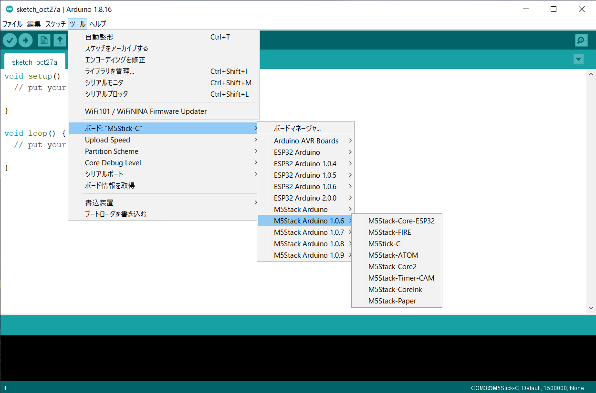
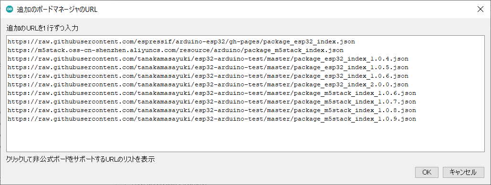
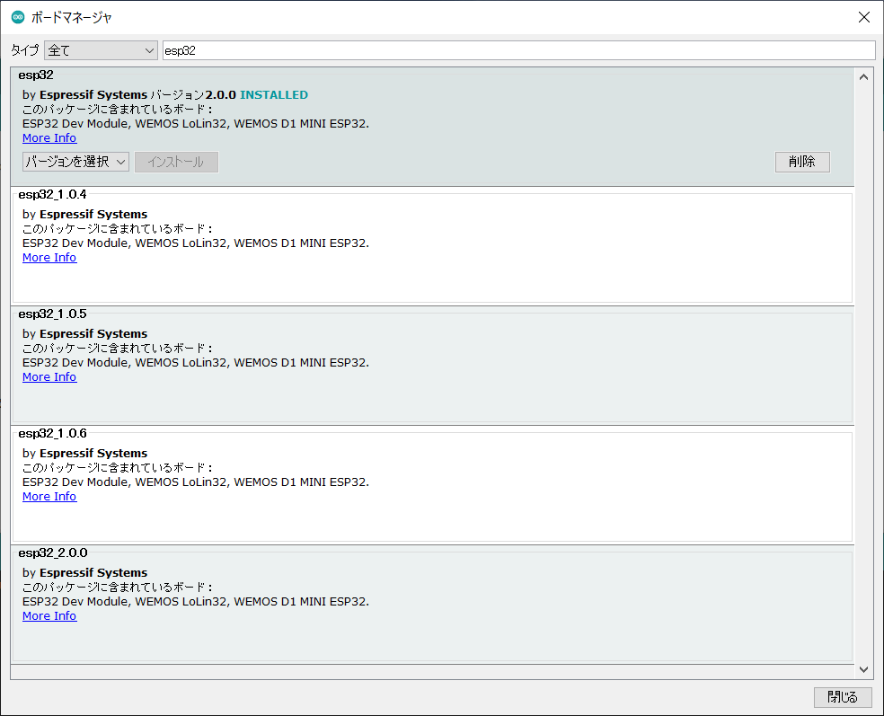
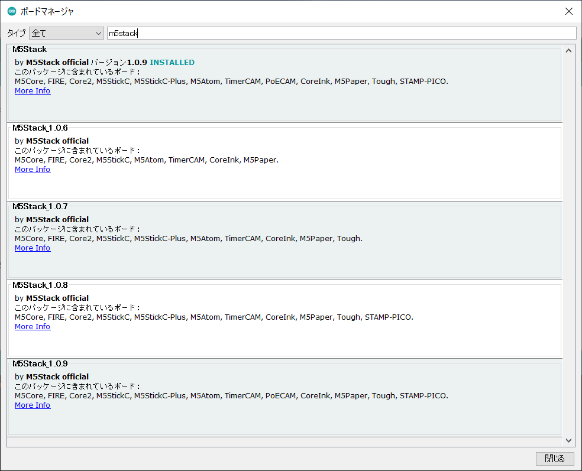
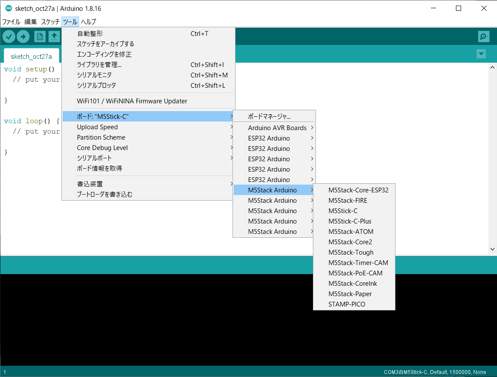

# Arduino ESP32 複数バージョン利用方法

Arduino IDEでESP32開発環境を複数のバージョンを共存させる場合に利用するjsonファイルです。

公式のファイルを編集しており、別ディレクトリにインストールすることにより、複数のバージョンを共存させています。インストールされるファイルには手を加えていません。



バージョンの選択はボード選択で行います。

## バージョン対応表

| ESP-IDF | arduino-esp32      | M5Stack                                                                                               | platform-espressif32                                                                                                                            | pioarduino                                            |
|---------|--------------------|-------------------------------------------------------------------------------------------------------|-------------------------------------------------------------------------------------------------------------------------------------------------|-------------------------------------------------------|
| 5.5.1   | 3.3.3(2025/11/06)  |                                                                                                       |                                                                                                                                                 | 55.03.33(2025/11/06)                                  |
| 5.5.1   | 3.3.2(2025/10/09)  |                                                                                                       |                                                                                                                                                 | 55.03.32(2025/10/09)                                  |
| 5.5.1   | 3.3.1(2025/09/17)  |                                                                                                       |                                                                                                                                                 | 55.03.31(2025/09/17)                                  |
| 5.5.0   | 3.3.0(2025/07/23)  |                                                                                                       |                                                                                                                                                 | 55.03.30-2(2025/08/16)<br>55.03.30-1(2025/07/28)<br>55.03.30(2025/07/23)        |
| 5.4.2   | 3.2.1(2025/07/03)  | 3.2.4(2025/10/28)<br>3.2.3(2025/09/16)<br>3.2.2(2025/07/15)                                           |                                                                                                                                                 | 54.03.21-2(2025/08/01)<br>54.03.21-1(2025/07/28)<br>54.03.21(2025/07/07)        |
| 5.4.1   | 3.2.0(2025/03/28)  | 3.2.1(2025/06/20)<br>3.2.0(2025/05/16)                                                                |                                                                                                                                                 | 54.03.20(2025/03/28)                                  |
| 5.3.2   | 3.1.3(2025/02/17)  |                                                                                                       |                                                                                                                                                 | 53.03.13-1(2025/05/30)<br>53.03.13%2Bgithub(2025/02/22)<br>53.03.13(2025/02/17) |
| 5.3.2   | 3.1.2(2025/02/13)  |                                                                                                       |                                                                                                                                                 | 53.03.12(2025/02/13)                                  |
| 5.3.2   | 3.1.1(2025/01/08)  |                                                                                                       |                                                                                                                                                 | 53.03.11(2025/02/09)                                  |
| 5.3.2   | 3.1.0(2024/12/17)  |                                                                                                       |                                                                                                                                                 | 53.03.10(2024/12/17)                                  |
| 5.1.4   | 3.0.7(2024/10/23)  |                                                                                                       |                                                                                                                                                 | 51.03.07(2024/10/23)                                  |
| 5.1.4   | 3.0.6(2024/10/21)  |                                                                                                       |                                                                                                                                                 | 51.03.06(2024/10/21)                                  |
| 5.1.4   | 3.0.5(2024/09/18)  |                                                                                                       |                                                                                                                                                 | 51.03.05(2024/10/12)                                  |
| 5.1.4   | 3.0.4(2024/08/02)  |                                                                                                       |                                                                                                                                                 | 51.03.04(2024/08/07)                                  |
| 5.1.4   | 3.0.3(2024/07/17)  |                                                                                                       |                                                                                                                                                 | 51.03.03(2024/07/17)                                  |
| 5.1.4   | 3.0.2(2024/06/25)  |                                                                                                       |                                                                                                                                                 | 51.03.02(2024/07/15)                                  |
| 5.1.4   | 3.0.1(2024/06/05)  |                                                                                                       |                                                                                                                                                 |                                                       |
| 5.1.4   | 3.0.0(2024/05/27)  |                                                                                                       |                                                                                                                                                 |                                                       |
| 4.4.7   | 2.0.17(2024/05/22) |                                                                                                       | 6.12.0(2025/07/31)<br>6.11.0(2025/05/27)<br>6.10.0(2025/01/26)<br>6.9.0(2024/09/26)<br>6.8.1(2024/07/31)<br>6.8.0(2024/07/30)                   |                                                       |
| 4.4.7   | 2.0.16(2024/04/30) |                                                                                                       | 6.7.0(2024/05/14)                                                                                                                               |                                                       |
| 4.4.7   | 2.0.15(2024/04/11) |                                                                                                       |                                                                                                                                                 |                                                       |
| 4.4.6   | 2.0.14(2023/10/05) | 2.1.4(2025/03/19)<br>2.1.3(2024/12/10)<br>2.1.2(2024/09/19)<br>2.1.1(2024/03/07)<br>2.1.0(2024/01/10)<br>2.0.9(2023/12/12)<br>2.0.8(2023/10/16) | 6.6.0(2024/03/30)<br>6.5.0(2023/12/27)                                                                |                                                       |
| 4.4.5   | 2.0.13(2023/09/15) |                                                                                                       |                                                                                                                                                 |                                                       |
| 4.4.5   | 2.0.12(2023/09/05) |                                                                                                       |                                                                                                                                                 |                                                       |
| 4.4.5   | 2.0.11(2023/07/24) |                                                                                                       | 6.4.0(2023/08/31)                                                                                                                               |                                                       |
| 4.4.5   | 2.0.10(2023/07/17) |                                                                                                       |                                                                                                                                                 |                                                       |
| 4.4.4   | 2.0.9(2023/05/09)  |                                                                                                       | 6.3.2(2023/06/20)<br>6.3.1(2023/05/26)<br>6.3.0(2023/05/19)                                                                                     |                                                       |
| 4.4.4   | 2.0.8(2023/04/20)  |                                                                                                       | 6.2.0(2023/04/29)                                                                                                                               |                                                       |
| 4.4.4   | 2.0.7(2023/02/21)  |                                                                                                       | 6.1.0(2023/03/09)                                                                                                                               |                                                       |
| 4.4.3   | 2.0.6(2022/12/23)  | 2.0.7(2023/05/10)<br>2.0.6-1(2023/02/26)<br>2.0.6(2023/01/09)                                         | 6.0.1(2023/02/06)<br>6.0.0(2023/01/17)<br>5.4.0(2023/06/23)<br>5.3.0(2022/12/30)                                                                |                                                       |
| 4.4.2   | 2.0.5(2022/09/17)  | 2.0.5(2022/10/03)                                                                                     | 5.2.0(2022/09/30)                                                                                                                               |                                                       |
| 4.4.2   | 2.0.4(2022/07/06)  | 2.0.4(2022/08/16)                                                                                     | 5.1.1(2022/08/26)<br>5.1.0(2022/08/01)                                                                                                          |                                                       |
| 4.4.1   | 2.0.3(2022/03/30)  | 2.0.3(2022/05/12)                                                                                     | 5.0.0(2022/06/30)<br>4.4.0(2022/06/01)<br>4.3.0(2022/05/21)                                                                                     |                                                       |
| 4.4     | 2.0.2(2021/12/23)  | 2.0.2(2022/01/04)                                                                                     | 4.2.0(2022/04/29)                                                                                                                               |                                                       |
| 4.4     | 2.0.1(2021/11/09)  | 2.0.1(2021/12/20)                                                                                     | 4.1.0(2022/04/22)                                                                                                                               |                                                       |
| 4.4     | 2.0.0(2021/08/31)  | 2.0.0(2021/10/30)                                                                                     | 4.0.0(2022/04/22)                                                                                                                               |                                                       |
| 3.3.5   | 1.0.6(2021/03/26)  |                                                                                                       | 3.5.0(2022/01/28)<br>3.4.0(2021/11/12)<br>3.3.2(2021/08/31)<br>3.3.1(2021/07/27)<br>3.3.0(2021/06/30)<br>3.2.1(2021/05/31)<br>3.2.0(2021/03/29) |                                                       |
| 3.3     | 1.0.5(2021/02/23)  |                                                                                                       | 3.1.1(2021/03/19)<br>3.1.0(2021/02/26)                                                                                                          |                                                       |
| 3.2     | 1.0.4(2019/10/02)  | 1.0.9(2021/08/24)                                                                                     | 3.0.0(2021/01/30)<br>2.1.0(2020/12/02)                                                                                                          |                                                       |

## Arduino IDEにjsonを登録



Arduino IDEの追加のボードマネージャーに必要なバージョンのjsonを追加します。

```
https://espressif.github.io/arduino-esp32/package_esp32_index.json
https://espressif.github.io/arduino-esp32/package_esp32_dev_index.json
https://m5stack.oss-cn-shenzhen.aliyuncs.com/resource/arduino/package_m5stack_index.json

https://tanakamasayuki.github.io/esp32-arduino-test/package_esp32_index_1_0_6.json
https://tanakamasayuki.github.io/esp32-arduino-test/package_esp32_index_2_0_17.json

https://tanakamasayuki.github.io/esp32-arduino-test/package_esp32_dev_index_3_0_0-alpha3.json

https://tanakamasayuki.github.io/esp32-arduino-test/package_m5stack_index_1_0_6.json
https://tanakamasayuki.github.io/esp32-arduino-test/package_m5stack_index_2.1.0.json
```

## ボードマネージャでインストール




バージョン別に表示されますので個別にインストールします。

## (IDE1のみ)ボード選択メニューの名前を修正



追加した直後ですとどのバージョンかがわからないので修正します。

ただしArduino IDE2以降の場合にはバージョン番号付きの名前で表示されるので変更する必要はありません。

```
C:\Users\%USERNAME%\AppData\Local\Arduino15\packages
```

Windowsの場合上記のフォルダを開くとバージョン別のボードが並んでいます。

```
C:\Users\%USERNAME%\AppData\Local\Arduino15\packages\esp32_2.0.0\hardware\esp32\2.0.0\platform.txt
```

ESP32 for Arduino 2.0.0の場合には上記にplatform.txtがあります。

```
- name=ESP32 Arduino
+ name=ESP32 Arduino 2.0.0
```

一行目がボード選択で表示されるグループ名なので、ここをわかりやすい名前に変更します。

## PlatformIOのplatformio.ini例
```
[env:m5stack-basic]
platform = espressif32@3.3.2 ;ESP-IDF(3.3.5), Arduino(1.0.6)
framework = arduino
board = m5stack-core-esp32
lib_ldf_mode = deep
monitor_speed = 115200
build_flags = -DCORE_DEBUG_LEVEL=0 ;0:None, 1:Error, 2:Warn, 3:Info, 4:Debug, 5:Verbose
;upload_port = COM3
;board_build.partitions = no_ota.csv ;https://github.com/espressif/arduino-esp32/tree/master/tools/partitions
lib_deps = 
  m5stack/M5Stack
```

## pioarduinoのplatformio.ini例
PlatformIO標準のESP32はバージョン3系をサポートしていません。3系を利用したい場合にはpioarduinoの利用が推奨されています。
https://github.com/pioarduino/platform-espressif32
```
[env:stable]
platform = https://github.com/pioarduino/platform-espressif32/releases/download/stable/platform-espressif32.zip
board = ...
```
上記のstableを指定するとそのときの最新バージョンになります。
明示的にバージョン54.03.21を利用したい場合にはstableの部分を54.03.21に書き換えたものになります。
```
platform = https://github.com/pioarduino/platform-espressif32/releases/download/54.03.21/platform-espressif32.zip
```
